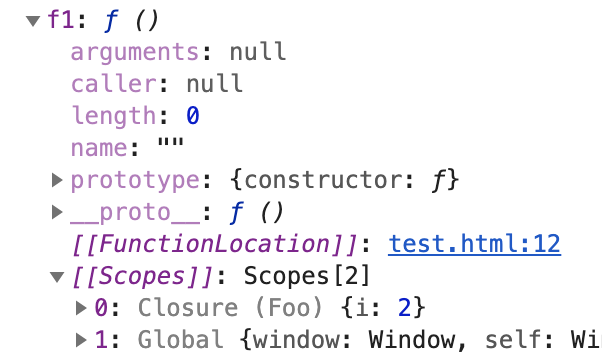

# 题

## 题目

```javascript
function Foo() {
  var i=0;
  return function () {
    console.log(i++);
  }
}
var f1 = Foo();
var f2 = Foo();
f1();
f1();
f2();
```

## 参考

知识点：

1. 闭包
1. i、i++与++i

输出结果：0 1 0

### 闭包

f1，f2都是函数，内部分别存储单独i，每调用一次函数，会copy一份i存储在function scopes，所以每个闭包的各个i互不影响，详情查看下图,变量f1的scopes中存储一个Closure（Foo）



### i、i++与++i

i++和++i，上面代码第一次调用f1，i++是0，i是1，如果改为++i，答案就是1 2 1

```javascript
let i=0;
console.log(i)
console.log(++i)
console.log(i)
// 0 1 1
```

```javascript
let i=0;
console.log(i)
console.log(i++)
console.log(i)
// 0 0 1
```

由上可知，i、i++与++i是不同的，不过另一方面下面的i++ ++i似乎没什么不同

```javascript
for (let i=0;i<3;i++){
  console.log(i) // 0 1 2
}
for (let i=0;i<3;++i){
  console.log(i) // 0 1 2
}
```

差异在于是否直接使用，for循环中，我们只是用i++(或++i）做了增1操作，并没有直接在增加时使用，而案例中用console.log()直接使用了他们。

i++和++i到底有什么区别，可以参考下方C++

1. 理论上++i更快，实际与编译器优化有关，通常几乎无差别。
1. 简单来说，i++返回的是i的值，++i返回i+1的值

```c++
//i++：                                    
int operator++(int)                                  
{
  int temp = *this;                                     
  ++*this;                                             
  return temp;                                    
}
// ++i
int& operator++()
{
  *this += 1;
  return *this;
}
```

# 题

## 题目

```javascript
var tt = 1;
function tt() {}
console.log(tt)
```

## 参考

知识点：变量提升与预解析

输出：1

详细：

1. 首先应该避免这种重名
1. 如果出现，应该了解var和function都进行变量提升，预解析是有优先级的，在var和function中，function先解析，且两者解析不同，var解析成undefined，function会指向真实function。

思维串联：函数声明和函数表达式，函数声明我们可以在定前调用，函数表达式我们只能在定义后调用，与上面是同一个思路

```javascript
var test = function () {return '函数表达式'}
function test(){ return '函数声明'}
console.log(test) // 函数表达式
```

通常我们会简单的说，函数声明有变量提升，函数表达式没有，但通过上面的分析可以了解到这种说法是不严谨的，var的函数表达式也有变量提升，只是提升成了undefined，我们仍然无法当正常函数调用。
